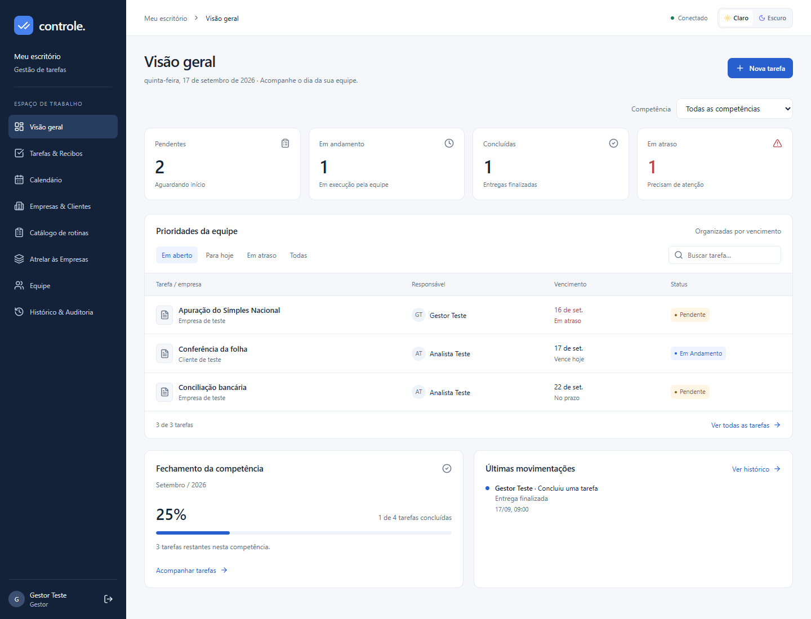

# Controle de Tarefas

Sistema de gestão de rotinas contábeis para organizar tarefas, competências, prazos, empresas, equipe e recibos em uma base compartilhada.

Construído com React 19, Vite 8 e Supabase (Auth, PostgreSQL e Storage).

## Interface



*Captura da aplicação com dados fictícios usados nos testes. Esses dados não são cadastrados na instalação.*

- Menu lateral azul-escuro e painel com indicadores de tarefas pendentes, em andamento, concluídas e em atraso.
- Prioridades em tabela, com busca por tarefa, empresa ou responsável e filtros por prazo e competência.
- Detalhes em painel lateral: status, checklist, orientações e download do recibo.
- Progresso do fechamento da competência e últimas movimentações da equipe.
- Temas claro e escuro, preferência salva no navegador e layout adaptado para celular.

## Funcionalidades

| Área | Recursos |
| --- | --- |
| Tarefas e recibos | Cadastro, edição, checklist, prioridade, responsável, competência e comprovantes de entrega. |
| Recorrências | Geração do próximo ciclo conforme a frequência, com prevenção de duplicatas. |
| Empresas e clientes | Cadastro e associação de responsáveis e rotinas. |
| Catálogo de rotinas | Modelos compartilhados para padronizar o trabalho do escritório. |
| Vinculação às empresas | Criação de tarefas em lote por empresa e competência. |
| Calendário | Vencimentos das tarefas cadastradas. |
| Equipe | Gestão de colaboradores, cargos e carteiras de empresas. |
| Histórico | Alterações registradas pelo servidor com data, hora e autor. |

## Acesso e permissões

O login é individual, com e-mail e senha pelo **Supabase Auth**. Todos os membros autorizados compartilham os dados de um único escritório. Somente o gestor administra a equipe e realiza exclusões; as permissões também são aplicadas no banco por políticas RLS.

O catálogo fica no banco e novos recibos são armazenados em um bucket privado. A aplicação confirma alterações somente depois de salvar no servidor e informa falhas sem descartar os dados do formulário.

**Sem configurar o Supabase, o login fica bloqueado.** O cadastro em **Equipe** não cria uma senha: também é necessário criar a conta correspondente no Supabase Authentication, com o mesmo e-mail confirmado.

## Instalação e configuração

Requer Node.js 22.12 ou superior na linha 22, ou Node.js 24 ou superior, e npm.

```sh
git clone https://github.com/AllanGomesprog/controle-tarefas.git
cd controle-tarefas
npm ci
```

1. Crie um projeto Supabase exclusivo para o escritório.
2. Execute o arquivo [supabase_schema.sql](supabase_schema.sql) inteiro no SQL Editor. Para atualizar uma instalação existente, leia as orientações de migração no guia antes de executar.
3. Crie a conta do primeiro gestor no Supabase Authentication e autorize seu e-mail em `team_members`, conforme o [guia de ativação](ACESSO_E_IMPLANTACAO.md#1-banco-e-primeiro-gestor).
4. Copie `.env.example` para `.env` e preencha:

```dotenv
VITE_SUPABASE_URL=https://SEU_PROJETO.supabase.co
VITE_SUPABASE_ANON_KEY=SUA_CHAVE_PUBLICA
```

Use a chave pública do projeto. Nunca coloque uma chave `service_role` no frontend. O `.env` não deve ser enviado ao repositório.

5. Inicie o ambiente de desenvolvimento:

```sh
npm run dev
```

As variáveis de ambiente são incorporadas durante o build. Ao alterá-las, reinicie o desenvolvimento ou gere um novo build de produção.

## Build e acesso por IP

```sh
npm run build
npm start
```

O servidor local serve a pasta `dist` em `http://127.0.0.1:8080`.

Para testar com outros computadores na mesma rede:

```sh
npm run start:lan
```

O terminal mostra os IPs disponíveis. Use o endereço da rede privada, por exemplo `http://192.168.1.50:8080`, e configure o firewall para permitir a porta na rede privada.

**Acesso de fora do escritório:** exige hospedagem ou servidor acessível, configuração de rede e HTTPS. O IP privado da rede local não é acessível diretamente pela internet. O projeto inclui um servidor Node com suporte a TLS e configurações do Caddy em `deploy/`.

Siga [ACESSO_E_IMPLANTACAO.md](ACESSO_E_IMPLANTACAO.md) para configurar o acesso externo por IP, certificados, contas, migração e backups. Enviar o código ao GitHub não publica o sistema nem configura automaticamente o Supabase ou a rede. Não use o servidor de desenvolvimento Vite para publicação externa.

## Comandos

| Comando | Finalidade |
| --- | --- |
| `npm run dev` | Desenvolvimento local com Vite. |
| `npm run dev:lan` | Desenvolvimento acessível pela rede local. |
| `npm run build` | Gera o build em `dist`. |
| `npm start` | Serve o build no endereço local, porta 8080. |
| `npm run start:lan` | Serve o build pelas interfaces de rede disponíveis. |
| `npm run lint` | Executa a análise estática. |
| `npm test` | Testa domínio, API, servidor e banco em memória. |
| `npm run test:e2e` | Executa os testes de navegador com Playwright. |

## Validação

```sh
npm run lint
npm test
npm run build
npx playwright install chromium
npm run test:e2e
```

Para usar o Chrome já instalado no Windows, execute no PowerShell:

```powershell
$env:PLAYWRIGHT_CHANNEL = 'chrome'
npm run test:e2e
```

Os testes cobrem datas e recorrências, tratamento de erros, proteção do servidor, RLS, auditoria, concorrência, autenticação, permissões, filtros, checklist e navegação responsiva, inclusive em largura de 320 px.

Os testes SQL usam PostgreSQL em memória (PGlite), com autenticação e storage simulados. Os testes de navegador usam uma API simulada e não acessam um projeto Supabase real. Após configurar a hospedagem, valide também o login e a gravação com contas reais em dispositivos diferentes e o acesso de fora da rede.

## Regras e limites

- Datas de vencimento preservam o dia no fuso brasileiro.
- Recorrências respeitam frequência e competência, inclusive quando o vencimento ocorre em outro mês.
- Conclusão e geração do próximo ciclo são gravadas juntas em transação. Conflitos de versão recusam alterações desatualizadas.
- A geração em lote evita duplicatas por empresa, rotina e competência. Dias são ajustados ao último dia válido do mês.
- Não há edição offline com sincronização posterior.
- O calendário mostra tarefas cadastradas. Os modelos de obrigações são sugestões; o escritório deve confirmar os prazos.
- Recibos aceitam PDF, JPG e PNG de até 10 MB. Anexos legados em base64 continuam legíveis.
- O histórico mostra os últimos 200 registros; o histórico completo permanece no banco. A aplicação não permite apagar a auditoria.
- A sessão fica na aba do navegador. Recuperação de acesso é administrada pelo responsável no Supabase.
- Dados antigos em `localStorage` não são apagados nem importados automaticamente. Consulte o guia antes de migrar dados reais.

## Estrutura

```text
src/
  App.jsx                  Navegação e composição das telas
  components/              Telas, formulários e painel lateral de tarefas
  hooks/useWorkspace.js    Sessão, atualização da base e operações
  lib/workspaceApi.js      Mapeamento, persistência e recibos
  utils/                   Datas, competências e recorrências
  index.css                Tokens visuais e estilos compartilhados
  workspace.css            Layout responsivo e componentes do novo design
scripts/serve.mjs          Servidor estático HTTP/HTTPS
deploy/                   Configurações do Caddy
tests/                    Testes de domínio, SQL, servidor e navegador
docs/images/              Capturas da interface para documentação
supabase_schema.sql       Esquema, migração, RLS, transações e storage
```

- [Guia de acesso e implantação](ACESSO_E_IMPLANTACAO.md)
- [Análise técnica da versão original](ANALISE_TECNICA.md) — diagnóstico histórico anterior às correções.

## Licença

Este projeto é de uso restrito e confidencial. Todos os direitos reservados.
